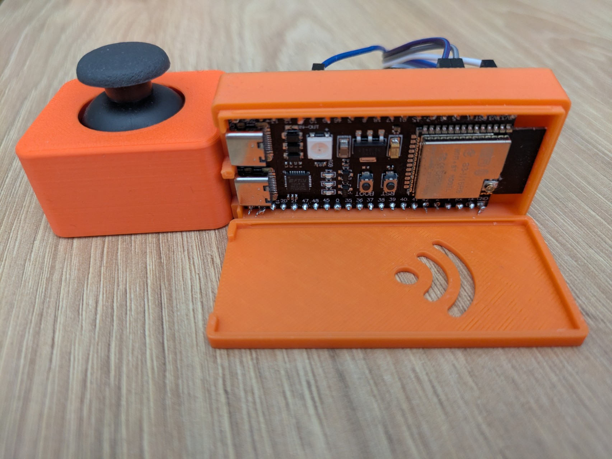

# PicoROS Playground

This repository is a small playground for experimenting with the [PicoROS](https://github.com/Pico-ROS/Pico-ROS-software) framework on an ESP32-S3 microcontroller.

The project structure was initially extracted from the ROSCon 2025 Workshop
[embedded-mobile-base](https://github.com/ros-controls/roscon2025_control_workshop/tree/master/embedded-mobile-base)
repository, and then adapted to host multiple small examples (starting with a joystick teleop node).

## What this project provides

- A PlatformIO-based ESP32-S3 project using:
  - [PicoROS](https://github.com/ros-controls/picoros) as the ROS 2 client library.
  - [Zenoh](https://zenoh.io/) via `rmw_zenoh_cpp` as the ROS 2 middleware on the host.
- An example `joystick_teleop` node that:
  - Reads a joystick via ADC and a button via GPIO.
  - Publishes `geometry_msgs/msg/TwistStamped` messages on the `/cmd_vel` topic.
  - Uses WiFi + SNTP to obtain a proper wall-clock time on the ESP32.
- Reusable patterns taken from the `embedded_mobile_base` example:
  - LED initialization and status indication.
  - PicoROS node and publisher setup.
  - Serial link configuration between ESP32 and Zenoh router.

This is intended as a sandbox to try out, hack on, and extend PicoROS-based firmware, not a polished product.

## Repository layout (relevant parts)

- `src/main.cpp`
  Entry point that selects which example to run (currently `joystick_teleop`).

- `src/joystick_teleop.h`
  
  Joystick teleoperation example:
  - Initializes LEDs, NVS, WiFi, and SNTP.
  - Connects to a Zenoh router over serial using PicoROS.
  - Publishes `/cmd_vel` commands based on joystick input.
  - Publishes `/grasping` commands based on button input.

- `src/embedded_mobile_base.h`
  Original mobile base example from the ROSCon workshop:
  - Subscribes to `/picoros/joint_commands` for velocity commands.
  - Publishes `/picoros/joint_states` with position, velocity, and effort feedback.
  - Calculates desired joint positions from velocity commands.
  - Updates LED color based on robot motion (forward, turning, arc movements).

- `src/flashing_leds.h`
  Simple LED flashing example for testing the LED strip:
  - Cycles through blue, red, and green colors at 1 second intervals.

- `src/joystick_leds.h`
  Example that maps joystick axis positions to LED colors:
  - X axis positive → red intensity.
  - Y axis positive → green intensity.
  - Y axis negative → blue intensity.
  - Button press toggles LED control on/off.

- `src/wifi_time.h`
  Helper utilities for:
  - Connecting to a WiFi network as a station.
  - Initializing SNTP and waiting until the system time is set.

- `include/my_ros_message_types.h`
  Generated ROS message type definitions for use with PicoROS serialization.

- `platformio.ini`
  PlatformIO project configuration for ESP32-S3.

- `sdkconfig.esp32-s3-devkitc-1`
  ESP-IDF SDK configuration for the ESP32-S3-DevKitC-1 board.

Other source and configuration files largely follow the structure of the original `embedded-mobile-base` workshop project.

## Joystick Teleop Input Mapping

### Joystick Axes (X and Y)

1. **Hardware**: Two analog axes connected to GPIO4 (VRX) and GPIO5 (VRY), read via ADC1 channels 3 and 4.

2. **Normalization**: Raw ADC values (0–4095) are converted to a float range of -1.0 to +1.0:
   - ADC 0 → -1.0
   - ADC ~2048 → 0.0
   - ADC 4095 → +1.0
   - A dead zone of ±0.1 around center returns 0.0 to prevent jitter.

3. **Velocity mapping**:
   - **X axis (VRX)**: Controls `linear.x` (forward/backward). Pushing forward → positive velocity.
   - **Y axis (VRY)**: Controls `linear.y` (left/right). The sign is inverted, so pushing left → positive velocity.
   - Both are scaled by `MAX_LINEAR_VEL_MPS` (0.5 m/s).

### SW Button (GPIO10)

The button has **two behaviors** based on press duration:

#### Short Press (< 1 second)
- Increments a `switch_counter` on button release.
- Controls Z-axis motion based on `counter % 4`:
  - `counter % 2 == 0` → **STOP** (linear.z = 0)
  - `counter % 4 == 1` → **UP** (linear.z = 0.2 m/s)
  - `counter % 4 == 3` → **DOWN** (linear.z = -0.2 m/s)

So the sequence is: STOP → UP → STOP → DOWN → STOP → UP → ...

#### Long Press (≥ 1 second)
- Toggles the `grasping` boolean.
- The grasping state is published on the `/grasping` topic as a `std_msgs/Bool`.

### Summary Table

| Input | Action | ROS Output |
|-------|--------|------------|
| Joystick X | Forward/back velocity | `cmd_vel.twist.linear.x` |
| Joystick Y | Left/right velocity | `cmd_vel.twist.linear.y` |
| Short press SW | Cycle Z motion (stop→up→stop→down) | `cmd_vel.twist.linear.z` |
| Long press SW | Toggle grasping mode | `/grasping` Bool |
